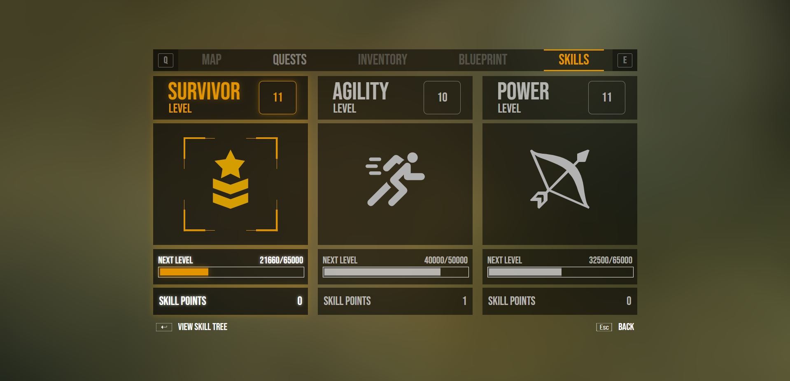

# Videogame UI

This is an user interface demo for a videogame.

This app is deployed [here](https://videogame-ui.vercel.app/) (without key navigation)

Video de presentación: [youtube](https://www.youtube.com/watch?v=-KJwEYkeoYY)

(There were a few changes on the UI after the video)

To run this app locally:

- git clone https://github.com/nchvrgr/videogameUI.git
- cd videogameUI
- npm install
- npm start

    

